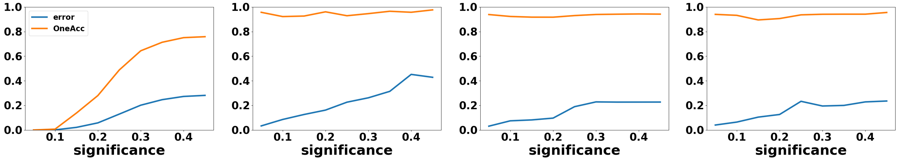

# DT-Sampler

  
## Details
You can find more details about DT-Sampler at [TBD]. The previous version of DT-Sampler (ICML2023 Workshop paper) can be found at [https://arxiv.org/abs/2307.13333](https://arxiv.org/abs/2307.13333) and its original codebase at [https://github.com/tsudalab/DT-sampler](https://github.com/tsudalab/DT-sampler).

## Method overview:

### SAT-based decision tree encoding
We propose an efficient SAT-based approach(only branch node encoding) for constructing decision trees . By introducing a small set of variables and constraints, this method can ensure high accuracy and reduce the search space.


### Decision tree sampling
DT-sampler is an ensemble model based on decision tree sampling. Different from random forest, DT-sampler uniformly samples decision trees from a given space, which can generate more stable results and provide higher interpretability compared to random forest. DT-sampler only has two key parameters: #node and threshold. #node constrains the size of decision trees generated by DT-sampler and threshold ensures a minimum training accuracy for each decision tree.


### Calibration using conformal prediction

We use conformal prediction to conformalize the sampled trees by a DT-sampler, each offering a coverage guarantee at level   $1-\alpha$. Unlike a standard decision tree that yields a single best guess, a conformal tree outputs a prediction set $\mathcal{C}_{\alpha}(x)$ that contains the (unknown) true label y of a test example x with probability at least $1-\alpha$.This coverage-driven approach ensures statistical validity while maintaining interpretability, especially when restricting tree size. 

By combining SAT-based tree generation with conformal calibration, we achieve flexible, controllable decision tree ensembles that retain the benefits of smaller, interpretable models without sacrificing performance guarantees.



### Feature importance measurement:

The feature importance is defined as the contribution of each feature to a high accuracy space.


① Encode the construction of decision trees as a SAT problem. \
② Utilize SAT sampler to uniformly sample multiple satisfiable solutions from the high accuracy space.\
③ Decode the satisfiable solutions back into decision trees.\
④ Estimate the training accuracy distribution of the decision trees in the high accuracy space.\
⑤ Measure feature importance by calculating the emergence probability  of each feature.

## Environmental configuration
We recommend creating a virtual environment using conda or venv. The "requirements.txt" file 
has been provided to reproduce the environment. We tested our implementation using 
Python 3.12.8.

1. Create a Conda Virtual Environment
```bash
conda create -n dtsampler python=3.11.3 -y
conda activate dtsampler
```

2. Install Dependencies
```bash
pip install -r requirements.txt
```


## Quick Start
To encode a decision tree invoke the following function in `encode.py`.  

```python
get_solution(X_train, y_train, traget_nodes, true_n, export_path, is_leaf_sampling=True)
```

To train and generate sample decision trees execute the following code snippet.

```python
dt_sampler = DT_sampler(X_train, y_train, node_n, threshold, cnf_path)
dt_sampler.run(num_samples, method="unigen", sample_seed=seed)
```

And you check `example.ipynb` for a detailed understanding.

## Contact
Tsuda Laboratory (https://www.tsudalab.org/)

Department of Computational Biology and Medical Science
The University of Tokyo
